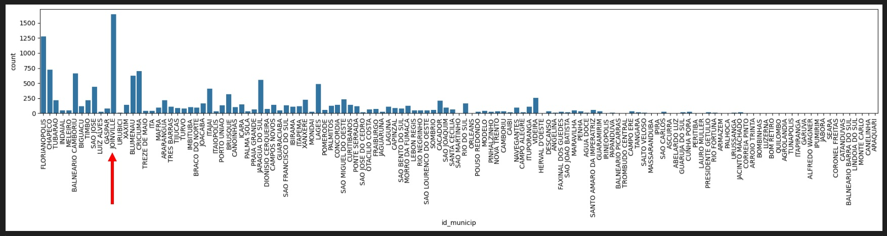
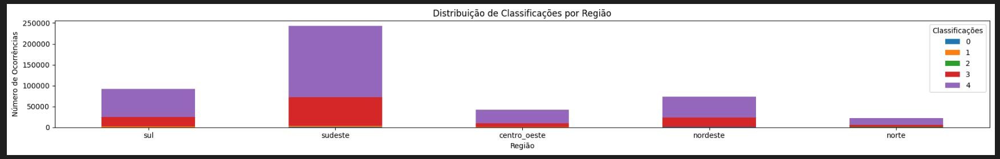
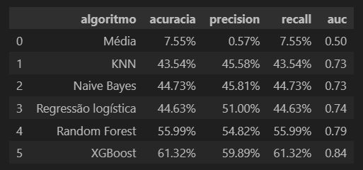

# Projeto Formulário Médico

Classificação para sínndrome respiratória agúda grave

## 1.	Problema de negócio
A classificação inadequada ou a falta de dados precisos sobre Síndrome Respiratória Aguda Grave (SRAG) pode levar a decisões de saúde pública ineficazes, subnotificação ou supernotificação de casos, monitoramento insuficiente da evolução da doença e dificuldades na identificação de tendências e surtos futuros. Além disso, dados imprecisos prejudicam a pesquisa científica, dificultando a descoberta de novos insights sobre a doença, seus fatores de risco, modos de transmissão e eficácia de tratamentos.

## 2.	Objetivo
Criar um sistema robusto de notificação e monitoramento que permita a coleta sistemática e padronizada de dados de saúde pública. Esse sistema visa facilitar a análise de dados epidemiológicos para apoiar a tomada de decisões em saúde pública, a detecção precoce de surtos e a implementação de medidas preventivas e de controle.

## 3.	Premissas do negócio
Seguem abaixo as premissas para as variáveis abaixo: 
'tipo_idade': {'Dia': 1, 'Mês': 2, 'Ano': 3},
'cs_sexo': {'M': 0, 'F': 1},
'cs_gestant': {'1º Trimestre': 1, '2º Trimestre': 2, '3º Trimestre': 3, 'Idade Gestacional Ignorada': 4, 'Não': 5, 'Não se aplica': 6, 'Ignorado': 9},
'cs_zona': {'Urbana': 1, 'Rural': 2, 'Periurbana': 3, 'Ignorado': 9},
'cs_raca': {'Branca': 1, 'Preta': 2, 'Amarela': 3, 'Parda': 4, 'Indígena': 5, 'Não declarada': 6, 'Outra': 9},
'cs_escol_n': {'Sem escolaridade': 0, 'Fundamental 1º ciclo (1ª a 5ª série)': 1, 'Fundamental 2º ciclo (6ª a 9ª período)': 2, 'Médio (1º ao 3º ano)': 3, 'Superior': 4, 'Não se aplica': 5, 'Ignorado': 9},
'nosocomial': {'Sim': 1, 'Não': 2, 'Ignorado': 9},
'ave_suino': {'Sim': 1, 'Não': 2, 'Ignorado': 9},
'vacina': {'Sim': 1, 'Não': 2, 'Ignorado': 9},
'antiviral': {'Sim': 1, 'Não': 2, 'Ignorado': 9},
'tp_antivir': {'Sim': 1, 'Não': 2, 'Ignorado': 9},
'raiox_res': {'Normal': 1, 'Infiltrado': 2, 'Consolidação': 3, 'Misto': 4, 'Outro': 5, 'Não realizado': 6, 'Ignorado': 9},
'suport_ven': {'Sim, invasivo': 1, 'Sim, não invasivo': 2, 'Não': 3, 'Ignorado': 9},
'fator_risc': {'Sim': 1, 'Não': 2, 'Ignorado': 9},
'puerpera': {'Sim': 1, 'Não': 2, 'Ignorado': 9},
'sind_down': {'Sim': 1, 'Não': 2, 'Ignorado': 9},
'diabetes': {'Sim': 1, 'Não': 2, 'Ignorado': 9},
'imunodepre': {'Sim': 1, 'Não': 2, 'Ignorado': 9},
'cardiopati': {'Sim': 1, 'Não': 2, 'Ignorado': 9},
'hepatica': {'Sim': 1, 'Não': 2, 'Ignorado': 9},
'neurologic': {'Sim': 1, 'Não': 2, 'Ignorado': 9},
'renal': {'Sim': 1, 'Não': 2, 'Ignorado': 9},
'hematologi': {'Sim': 1, 'Não': 2, 'Ignorado': 9},
'asma': {'Sim': 1, 'Não': 2, 'Ignorado': 9},
'pneumopati': {'Sim': 1, 'Não': 2, 'Ignorado': 9},
'obesidade': {'Sim': 1, 'Não': 2, 'Ignorado': 9},
'febre': {'Sim': 1, 'Não': 2, 'Ignorado': 9},
'saturacao': {'Sim': 1, 'Não': 2, 'Ignorado': 9},
'tosse': {'Sim': 1, 'Não': 2, 'Ignorado': 9},
'diarreia': {'Sim': 1, 'Não': 2, 'Ignorado': 9},
'garganta': {'Sim': 1, 'Não': 2, 'Ignorado': 9},
'vomito': {'Sim': 1, 'Não': 2, 'Ignorado': 9},
'dispneia': {'Sim': 1, 'Não': 2, 'Ignorado': 9},
'desc_resp': {'Sim': 1, 'Não': 2, 'Ignorado': 9},
'dor_abd': {'Sim': 1, 'Não': 2, 'Ignorado': 9},
'fadiga': {'Sim': 1, 'Não': 2, 'Ignorado': 9},
'perd_olft': {'Sim': 1, 'Não': 2, 'Ignorado': 9},
'perd_pala': {'Sim': 1, 'Não': 2, 'Ignorado': 9},
'hospital': {'Sim': 1, 'Não': 2, 'Ignorado': 9},
'uti': {'Sim': 1, 'Não': 2, 'Ignorado': 9},
'amostra': {'Sim': 1, 'Não': 2, 'Ignorado': 9},
'tp_amostra': {'Secreção de Naso-orofaringe': 1, 'Lavado Broco-alveolar': 2, 'Tecido post_mortem': 3, 'Outra': 4, 'LCR': 5, 'Ignorado': 9},
'tomo_res': {'Típico covid-19': 1, 'Indeterminado covid-19': 2, 'Atípico covid-19': 3, 'Negativo para Pneumonia': 4, 'Outro': 5, 'Não realizado': 6, 'Ignorado': 9},
'vacina_cov': {'Sim': 1, 'Não': 2, 'Ignorado': 9},
'dose_1_cov': {'Sim': 1, 'Não': 2, 'Ignorado': 9},
'dose_2_cov': {'Sim': 1, 'Não': 2, 'Ignorado': 9},
'dose_ref': {'Sim': 1, 'Não': 2, 'Ignorado': 9}}

## 4.	Estratégia adotada para solução

Passo 1 - Descrição dos dados: O objetivo deste passo é ter um entendimento inicial de como os dados estão relacionados com o problema de negócio proposto, para tal, lançando mão de algumas métricas estatísticas de posição e distribuição.

Passo 2 - Engenharia de atributos: Neste passo foram criadas novas variáveis a partir das variáveis originais a fim de melhorar a qualidade dos dados facilitando seu o entendimento.

Passo 3 - Filtragem das variáveis: No processo de filtragem, busca-se selecionar e reter apenas as variáveis relevantes para a análise ou modelagem, com base nos objetivos do negócio e nas características do problema em questão.
 
Passo 4 - Análise exploratória: A análise exploratória dos dados (EDA) tem como principal objetivo proporcionar uma compreensão mais aprofundada dos dados, tais como: Compreender a distribuição das variáveis numéricas e categóricas, identificar outliers (valores atípicos), se existe desbalanceamento da variável resposta, correlações entre as variáveis entre outras análises.

Passo 5 - Preparação dos dados: Neste tópico, os dados serão transformados, ou seja, as variáveis categóricas serão convertidas em números, pois os algoritmos de machine learning não tem uma boa performance com dados não numéricos. Os dados também precisarão ser reescalados, ou seja, colocar as variáveis em uma escala comum.
 
Passo 6 - Seleção das variáveis: Neste passo o principal objetivo é selecionar as variáveis mais relevantes e descartar as menos importantes, para que estas sejam submetidas aos algoritmos de machine learning. Esta seleção é feita através de algoritmos específicos de seleção, com isso, busca-se reduzir a dimensionalidade dos dados sem perder em performance ao resultado final.

Passo 7 - Algoritmos de machine learning: Serão implementados alguns modelos de algoritmos de machine learning para possamos escolher o que melhor performou com os dados disponíveis.
 
Passo 8 - Ajuste dos hiperparâmetros: Com a definição do melhor modelo de machine learning, busca-se otimizar ainda mais a performance do modelo com alguns ajustes finos em seus parâmetros.

Passo 9 - Performance do negócio: Nesta etapa, o termo "performance do negócio" refere-se ao impacto que os modelos e análises têm nos resultados e metas de uma organização, pois busca garantir que as soluções propostas realmente tragam benefícios tangíveis para a empresa.

Passo 10 - Modelo em produção: Nesta etapa final, o melhor modelo treinado é implantado e usado em um ambiente operacional do mundo real. O objetivo principal deste passo de colocar um modelo em produção é transformar o trabalho de desenvolvimento de modelos em um sistema que pode fornecer valor contínuo e automático.

## 5.	Top 3 insights
Hipótese 1: Pessoas que vivem no interior de Santa Catarina não teriam tendência a contrair covid?
Falsa: Pessoas que vivem no interior de Santa Catarina teriam sim maior tendência a contrair covid.

Hipótese 2: Cidades da região sul tem maior tendência a contrair doenças respiratórias?
Falsa: Cidades da região sul não tem maior tendência a contrair doenças respiratórias e sim a região sudeste.

Hipótese 3: Pessoas que tomaram antiviral tiveram menos sintomas graves?
Falsa: Pessoas que não tomaram antiviral tiveram mais sintomas graves.

## 6.	Aplicação do modelo de machine learning
Foram feitos testes com vários algoritmos de machine learning, utilizando a técnica de cross-validation e ajuste fino dos parâmetros.

## 7.	Performance do modelo de machine learning
O algoritmo de machine learning escolhido foi o XGBRegressor.
 

## 8.	Resultado do negócio
Conforme mostrado na figura abaixo, foram adicionados mais 2 cenários além do predito para as próximas 6 semanas em todas as lojas Rossmann, ou seja, um cenário pessimista e outro otimista, com isso o gestou conseguirá tomar a melhor decisão frente aos valores encontrados.
 
 

## 9.	Conclusão
O resultado prático deste projeto de classificação de SRAG previsão de vendas para uma empresa de medicamentos da Europa, reflete-se na capacidade de adicionar cenários otimistas e pessimistas além das previsões tradicionais. Essa abordagem oferece aos gestores uma visão mais abrangente, permitindo a tomada de decisões mais informadas diante de diferentes contextos.
Dentre os principais insights, destacam-se a falsificação de hipóteses relacionadas à variedade de produtos, tendência de vendas ao longo dos anos e desempenho durante o feriado de Natal. Esses insights desafiam preconcepções e contribuem para uma compreensão mais precisa dos padrões de vendas.
Em última análise, o projeto não apenas fornece um modelo de previsão confiável, mas também agrega valor ao negócio ao oferecer insights valiosos e cenários alternativos. A implementação prática do modelo permite que a Rossmann tome decisões estratégicas mais fundamentadas em um ambiente de negócios dinâmico e complexo.

## 10.	Próximos passos
•	Fazer o balanceamento dos dados;
•	Testar outros algoritmos de machine learning;
•	Buscar novas variáveis para definir melhor o comportamento dos clientes.
